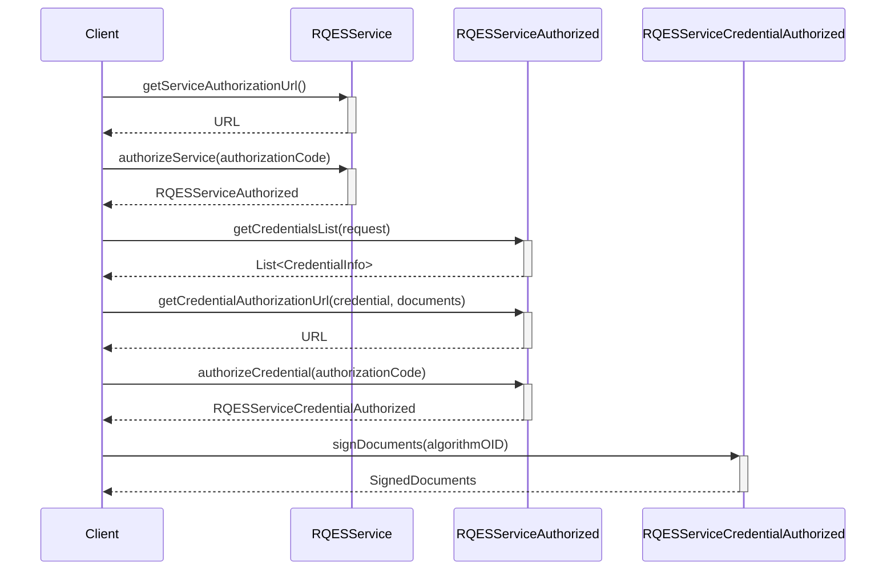

# Build your rQES Core for iOS

## Overview

The EUDI RQES Kit for iOS provides the essential functionality needed to enable Remote Qualified Electronic Signatures (RQES) within iOS applications. It offers a unified interface for retrieving authorization URLs, authorizing both the service and user credentials, and performing secure document signing operations. 

## Installation

To use RQES Kit, add the following dependency to your `Package.swift`:

```swift
dependencies: [
    .package(url: "https://github.com/niscy-eudiw/eudi-lib-ios-rqes-kit", exact: "0.6.4")
]
```

Then add the `eudi-lib-ios-rqes-kit` package to your target's dependencies:
```swift
dependencies: [
    .product(name: "RqesKit", package: "eudi-lib-ios-rqes-kit"),
]
```

## Integration guide

### Document signing flow



### 1. Create an RQES Service instance

```swift
let cscClientConfig = CSCClientConfig(
        OAuth2Client: CSCClientConfig.OAuth2Client(
                clientId: "wallet-client",
                clientSecret: "somesecret2"
        ),
        authFlowRedirectionURI: "https://oauthdebugger.com/debug", rsspId: "")
var rqesService = RQESService(
    clientConfig: cscClientConfig,
    defaultHashAlgorithmOID: .SHA256
)
```

### 2. Authorize the service

To authorize the service, you need to get the authorization URL and open it in a browser. After the user has authorized the service, the browser will be redirected to the `redirectUri`,
that is configured in the `CSCClientConfig`, with a query parameter named `code` containing the authorization code. You can then authorize the service by calling the `authorizeService` method:

1. Get the authorization URL

```swift
let authorizationUrl = try await rqesService.getServiceAuthorizationUrl()
``` 
2. Open the `authorizationUrl` in a browser.
3. After the user has authorized the service, the browser will be redirected to the `redirectUri` with a query parameter named "code" containing the authorization code

```swift
let authorizedService = try await rqesService.authorizeService(authorizationCode)
```
### 3. Select the credential 

With the authorized service, you can list the available credentials by calling the `getCredentialsList` method and choose the credenrtial you want to use.

```swift
let credentials = try await authorizedService.getCredentialsList()
// Choose the credential you want to use
let credential = credentials.first!
```

### 4. Prepare documents to be signed

```swift
let unsignedDocuments = [
Document(
label: "Document to sign",
fileURL: Bundle.main.url(
forResource: "document",
withExtension:"pdf")
)
)
]
```

### 5. Authorize the chosen credential

1. Get the credential authorization URL:
```swift
let credentialAuthorizationUrl = try await authorizedService.getCredentialAuthorizationUrl(
    credentialInfo: credential,
    documents: unsignedDocuments,
)
```
2. Use the `credentialAuthorizationUrl` to open a browser and let the user authorize the credential
3. After redirect, read the code parameter and authorize the credential.
```swift
let authorizedCredential = try await authorizedService.authorizeCredential(authorizationCode)
```
### 6. Sign the documents
```swift
let signAlgorithm = SigningAlgorithmOID.ECDSA_SHA256
let signedDocuments = try await authorizedCredential.signDocuments(signAlgorithmOID: signAlgorithm)
```
## Source code
The source code is available [here](https://github.com/eu-digital-identity-wallet/eudi-lib-ios-rqes-kit).

