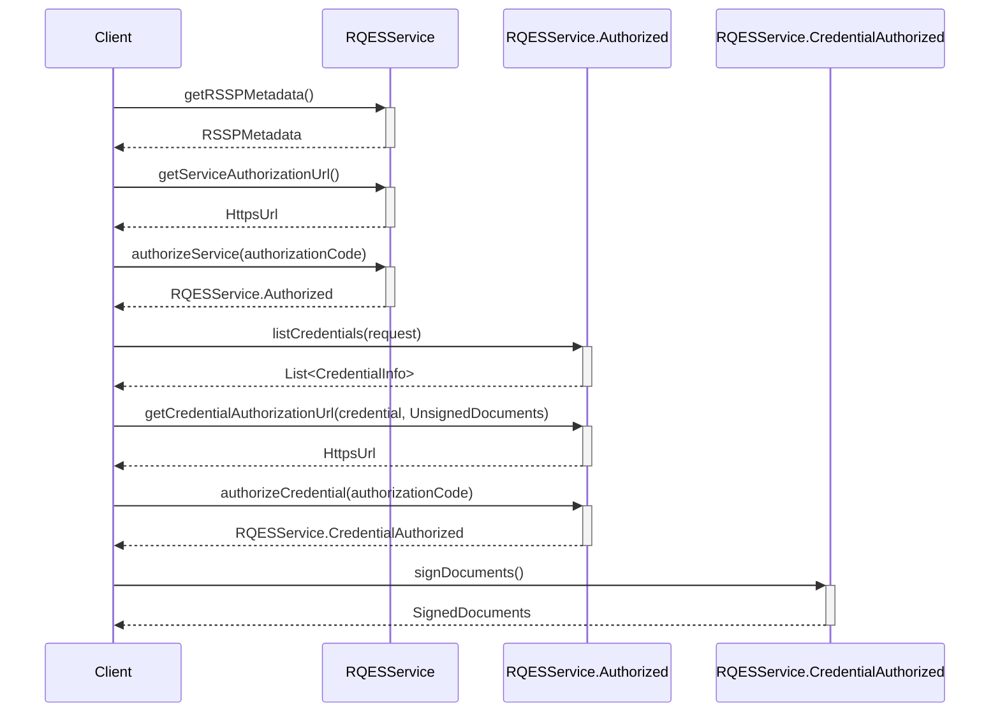

# Build your rQES Core for Android

The EUDI RQES Core SDK provides the foundational service logic for enabling Remote Qualified Electronic Signatures (RQES) in Android applications, including support for Document Retrieval. This document explains how to integrate and use the Core SDK in your project.

## Overview

This module provides the core functionality for the EUDI Wallet related to the Remote Qualified Electronic Signature (RQES) service. 

- Core functionality for the Remote Qualified Electronic Signature (RQES) service, including service authorization, credential authorization and document signing.
- Document Retrieval functionality, enabling the retrieval of documents from a Relying Party (RP) and the dispatch of signed documents or signatures back to the RP.

It is designed to ensure secure and compliant electronic signatures by interacting with authorized credentials and handling document signing process end to end.

## Requirements

- Android 8 (API level 29) or higher

### Dependencies

To use snapshot versions add the following to your project's settings.gradle file:

```kotlin
dependencyResolutionManagement {
    repositories {
        // .. other repositories
        maven {
            url = uri("https://central.sonatype.com/repository/maven-snapshots/")
            mavenContent { snapshotsOnly() }
        }
    }
}
```

To include the library in your project, add the following dependencies to your app's build.gradle
file.

```kotlin
dependencies {
    // EUDI Wallet RQES service library
    implementation("eu.europa.ec.eudi:eudi-lib-android-rqes-core:0.4.0")
}
```

## Integration guide

### Document Signing Flow

The following diagram illustrates the high-level steps of the RQES document signing flow, from service authorization to obtaining the final signed documents.



#### 1. Create an RQESService instance

```kotlin
val rqesService = RQESService(
    serviceEndpointUrl = "https://example.com/csc/v2",
    config = CSCClientConfig(
        client = OAuth2Client.Confidential.ClientSecretBasic(
            clientId = "client-id",
            clientSecret = "client-secret"
        ),
        authFlowRedirectionURI = URI("rqes:redirect"),
    ),
    outputPathDir = "/path/to/output/dir",
    // set the hashing algorithm that will be used
    // default is SHA-256 as shown below
    hashAlgorithm = HashAlgorithmOID.SHA_256,
    // optionally provide a HttpClientFactory to create a HttpClient for the service
    // this is useful for logging, testing, etc.
    httpClientFactory = {
        // create a HttpClient
        HttpClient(/* Configure */)
    }
)
```

You can fetch the RQES service metadata:

```kotlin
val metadata = rqesService.getRSSPMetadata().getOrThrow()
``` 

#### 2. Authorize the RQES service

First, obtain the service authorization URL and open it in a browser:

```kotlin
val authorizationUrl = rqesService.getServiceAuthorizationUrl().getOrThrow()

// Open the authorizationUrl in a browser
// After the user has authorized the service, the browser will be redirected to the authFlowRedirectionURI that
is configured in the `CSCClientConfig`
// with a query parameter named "code" containing the authorization code

When the redirect happens, extract the authorization code and authorize the service:

val authorizationCode = AuthorizationCode("code")
val authorizedService = rqesService.authorizeService(authorizationCode).getOrThrow()
```
#### 3. Select a credential and prepare documents
   
List available credentials:

```kotlin
val credentials = authorizedService.listCredentials().getOrThrow()
val credential = credentials.first() // choose whichever credential you want
```
Prepare documents to sign

```kotlin
val unsignedDocuments = UnsignedDocuments(
    UnsignedDocument(
        label = "Document to sign",
        file = File("document.pdf"),
        // Optionally override default signing configuration
        signingConfig = UnsignedDocument.Config(
            signatureFormat = SignatureFormat.P,
            conformanceLevel = ConformanceLevel.ADES_B_B,
            signedEnvelopeProperty = SignedEnvelopeProperty.ENVELOPED,
            asicContainer = ASICContainer.NONE
        )
    )
)
```
#### 4. Authorize the credential and sign

Obtain the credential authorizationURL to open a browser and let the user authorize the credential

```kotlin
val credentialAuthorizationUrl = authorizedService.getCredentialAuthorizationUrl(
    credential = credential,
    documents = unsignedDocuments,
    // Optional: signing algorithm. If omitted, the first supported algorithm of the credential is used.
    signingAlgorithmOID = SigningAlgorithmOID.ECDSA_SHA256
).getOrThrow()

// Open credentialAuthorizationUrl in a browser.
// After authorization, the browser will redirect to authFlowRedirectionURI
// with a query parameter "code" containing the credential authorization code.
```

Authorize the credential and sign the documents:

```kotlin
val credentialAuthorizationCode = AuthorizationCode("credential-code")

val authorizedCredential =
    authorizedService.authorizeCredential(credentialAuthorizationCode).getOrThrow()

val signedDocuments = authorizedCredential.signDocuments().getOrThrow()

// Manipulate the signed documents
signedDocuments.forEach { (label, file) ->
    // Use the signed file
    val fileContent = file.readBytes()
}
```

**Shortcut: sign directly from authorizedService**

You can also sign without explicitly calling authorizeCredential:
```kotlin
val signedDocumentsAlt = authorizedService.signDocuments(credentialAuthorizationCode).getOrThrow()
```

### Document Retrieval

This library is also implements a Document Retrieval functionality, that allows to 
- retrieve the documents to be signed from a Relying Party (RP)
- return signed documents or signatures.

The interactions with the RP are handled via DocumentRetrievalService, which is separate from the RQES service.

#### 1. Configure X509 trust

The library provides a default X509CertificateTrust implementation that:
- validates the certificate chain
- checks the trust anchor against a list of trusted certificates

```kotlin 
val x509CertificateTrust = X509CertificateTrust(
    trustedCertificates = listOf(
        // Add the trusted certificates
    ),
    // Optional logging
    logException = { th: Throwable -> th.printStackTrace() }
)
// Alternatively, provide your own X509CertificateTrust implementation.
```
#### 2. Instantiate DocumentRetrievalService

```kotlin 
val documentRetrievalService = DocumentRetrievalService(
    downloadTempDir = File(context.cacheDir, "downloads"),
    config = DocumentRetrievalConfig(
        jarConfiguration = JarConfiguration.Default,
        supportedClientIdSchemes = listOf(
            SupportedClientIdScheme.X509SanUri(x509CertificateTrust),
            SupportedClientIdScheme.X509SanDns(x509CertificateTrust),
        ),
    )
)
```

#### 3. Resolve documents

Given a request URI:

```kotlin 
val requestUri = Uri.parse("mdoc-openid4vp://...?request_uri=...&client_id=...")
val resolutionOutcome = documentRetrievalService.resolveDocument(requestUri).getOrThrow()

val resolvedDocuments = resolutionOutcome.resolvedDocuments

val unsignedDocuments = resolvedDocuments.toUnsignedDocuments(
    signingConfig = UnsignedDocument.Config.DEFAULT
)
```

Then follow the same signing steps as in the RQES flow. Once you have signedDocuments, dispatch them back to the RP:

```kotlin 
val dispatchOutcome = resolutionOutcome.dispatch(signedDocuments)
when (dispatchOutcome) {
    is DispatchOutcome.Accepted -> {
        val redirectUri = dispatchOutcome.redirectURI
        // redirect the user to the redirectUri
    }

    DispatchOutcome.Rejected -> {
        // handle the rejection
    }
}
```

#### Notes

- `SignedDocuments` implements the `Map` interface, with document labels as keys and corresponding signed document `File` objects as values. This allows for easy access to the signed files using their labels.

   Example:

  ```kotlin
  signedDocuments.forEach { (label, file) ->
      // Use the signed file
      val fileContent = file.readBytes()
  }
  ```
- If you want to use the `X509CertificateTrust` implementation provided by the library with
  BouncyCastle you must add the following dependencies to your project's build.gradle file:
    ```kotlin
    dependencies {
        // BouncyCastle
        implementation("org.bouncycastle:bcprov-jdk15on:1.78.1")
        implementation("org.bouncycastle:bcpkix-jdk15on:1.78.1")
    }
    ```
    
    Also, you need to add the BouncyCastle provider to the Security providers list:
    
    ```kotlin
    Security.addProvider(BouncyCastleProvider())
    ```

The source code is available [here](https://github.com/eu-digital-identity-wallet/eudi-lib-android-rqes-core/).
