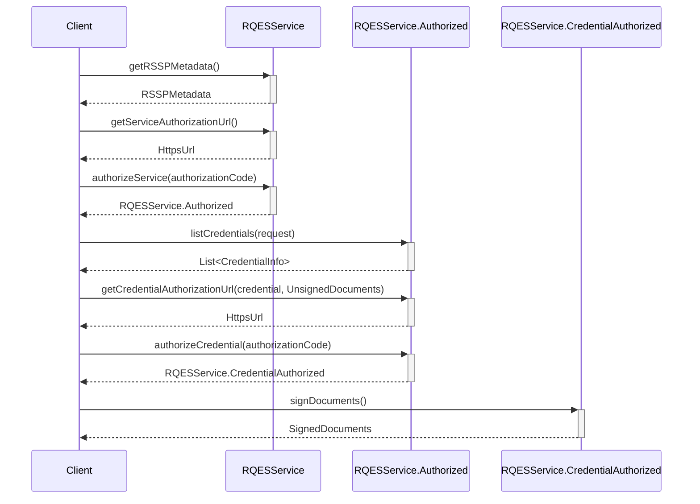

# Build your rQES Core for Android

The EUDI RQES Core SDK provides the foundational service logic for enabling Remote Qualified Electronic Signatures (RQES) in Android applications. This document explains how to integrate and use the Core SDK in your project.

## Overview

This module provides the core functionality for the EUDI Wallet related to the Remote Qualified Electronic Signature (RQES) service including service authorization, credential authorization and document signing.

## Requirements

Android 8 (API level 29) or higher

## Installation

To include the library in your project, add the following dependencies to your app's build.gradle
file.

```kotlin
dependencies {
    // EUDI Wallet RQES service library
    implementation("eu.europa.ec.eudi:eudi-lib-android-rqes-core:0.4.0")
}
```

## Integration guide

The following diagram illustrates the high-level steps of the RQES document signing flow, from service authorization to obtaining the final signed documents.



### 1. Create an RQESService instance

```kotlin
val rqesService = RQESService(
    serviceEndpointUrl = "https://example.com/csc/v2",
    config = CSCClientConfig(
        client = OAuth2Client.Confidential.ClientSecretBasic(
            clientId = "client-id",
            clientSecret = "client-secret"
        ),
        authFlowRedirectionURI = URI("rqes:redirect"),
    ),
    outputPathDir = "/path/to/output/dir",
    // set the hashing algorithm that will be used
    // default is SHA-256 as shown below
    hashAlgorithm = HashAlgorithmOID.SHA_256,
    // optionally provide a HttpClientFactory to create a HttpClient for the service
    // this is useful for logging, testing, etc.
    httpClientFactory = {
        // create a HttpClient
        HttpClient(/* Configure */)
    }
)
```

You can fetch the RQES service metadata:

```kotlin
val metadata = rqesService.getRSSPMetadata().getOrThrow()
``` 

### 2. Authorize the RQES service

First, obtain the service authorization URL and open it in a browser:

```kotlin
val authorizationUrl = rqesService.getServiceAuthorizationUrl().getOrThrow()

// Open the authorizationUrl in a browser
// After the user has authorized the service, the browser will be redirected to the authFlowRedirectionURI that
// is configured in the `CSCClientConfig`
// with a query parameter named "code" containing the authorization code
```
When the redirect happens, extract the authorization code and authorize the service:
```kotlin
val authorizationCode = AuthorizationCode("code")
val authorizedService = rqesService.authorizeService(authorizationCode).getOrThrow()
```
### 3. Select a credential and prepare documents
   
List available credentials:

```kotlin
val credentials = authorizedService.listCredentials().getOrThrow()
val credential = credentials.first() // choose whichever credential you want
```
Prepare documents to sign

```kotlin
val unsignedDocuments = UnsignedDocuments(
    UnsignedDocument(
        label = "Document to sign",
        file = File("document.pdf"),
        // Optionally override default signing configuration
        signingConfig = UnsignedDocument.Config(
            signatureFormat = SignatureFormat.P,
            conformanceLevel = ConformanceLevel.ADES_B_B,
            signedEnvelopeProperty = SignedEnvelopeProperty.ENVELOPED,
            asicContainer = ASICContainer.NONE
        )
    )
)
```
### 4. Authorize the credential and sign

Obtain the credential authorizationURL to open a browser and let the user authorize the credential

```kotlin
val credentialAuthorizationUrl = authorizedService.getCredentialAuthorizationUrl(
    credential = credential,
    documents = unsignedDocuments,
    // Optional: signing algorithm. If omitted, the first supported algorithm of the credential is used.
    signingAlgorithmOID = SigningAlgorithmOID.ECDSA_SHA256
).getOrThrow()

// Open credentialAuthorizationUrl in a browser.
// After authorization, the browser will redirect to authFlowRedirectionURI
// with a query parameter "code" containing the credential authorization code.
```

Authorize the credential and sign the documents:

```kotlin
val credentialAuthorizationCode = AuthorizationCode("credential-code")

val authorizedCredential =
    authorizedService.authorizeCredential(credentialAuthorizationCode).getOrThrow()

val signedDocuments = authorizedCredential.signDocuments().getOrThrow()

// Manipulate the signed documents
signedDocuments.forEach { (label, file) ->
    // Use the signed file
    val fileContent = file.readBytes()
}
```

You can also sign without explicitly calling authorizeCredential:
```kotlin
val signedDocumentsAlt = authorizedService.signDocuments(credentialAuthorizationCode).getOrThrow()
```
## Source code
The source code is available [here](https://github.com/eu-digital-identity-wallet/eudi-lib-android-rqes-core/).
