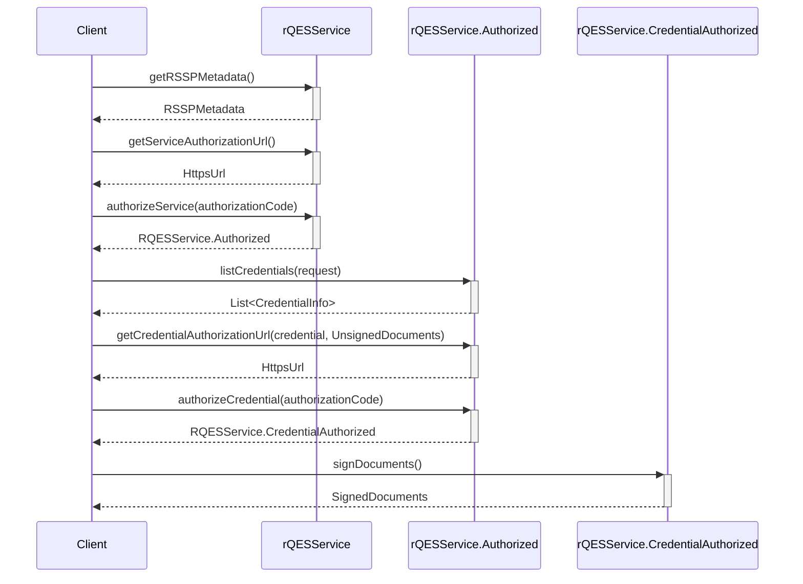

# Build your rQES Core for Android

The EUDI rQES Core SDK provides the foundational service logic for enabling Remote Qualified Electronic Signatures (RQES) in Android applications. This document explains how to integrate and use the Core SDK in your project.

## Overview

This SDK provides the core functionality for an EUDI Wallet to interact with a remote Qualified Electronic Signature (rQES) service. It handles service authorisation, credential authorisation, and document signing.

## Requirements

Android 10 (API level 29) or higher

## Installation

To include the library in your project, add the following dependencies to your app's `build.gradle` file.

```kotlin
dependencies {
    // EUDI Wallet rQES service library
    implementation("eu.europa.ec.eudi:eudi-lib-android-rqes-core:0.4.0")
}
```

## Integration guide

The following diagram illustrates the high-level steps of the rQES document signing flow, from service authorization to obtaining the final signed documents.



### 1. Create an rQES Service instance

```kotlin
val rqesService = rQESService(
    serviceEndpointUrl = "https://example.com/csc/v2",
    config = CSCClientConfig(
        client = OAuth2Client.Confidential.ClientSecretBasic(
            clientId = "client-id",
            clientSecret = "client-secret"
        ),
        authFlowRedirectionURI = URI("rqes:redirect"),
    ),
    outputPathDir = "/path/to/output/dir",
    // set the hashing algorithm that will be used
    // default is SHA-256 as shown below
    hashAlgorithm = HashAlgorithmOID.SHA_256,
    // optionally provide a HttpClientFactory to create a HttpClient for the service
    // this is useful for logging, testing, etc.
    httpClientFactory = {
        // create a HttpClient
        HttpClient(/* Configure */)
    }
)
```

You can fetch the rQES service metadata:

```kotlin
val metadata = rqesService.getRSSPMetadata().getOrThrow()
``` 

### 2. Authorize the rQES service

To begin the signing process, the user must authorise your application to use the rQES service.

First, obtain the service authorization URL and open it in a custom tab or browser:

```kotlin
val authorizationUrl = rqesService.getServiceAuthorizationUrl().getOrThrow()

// Open the authorizationUrl in a browser
// After the user has authorized the service, the browser will be redirected to the authFlowRedirectionURI that
// is configured in the `CSCClientConfig`
// with a query parameter named "code" containing the authorization code
```

After the user grants authorisation, the service will redirect to the authFlowRedirectionURI you configured, appending an authorisation code as a query parameter. Your app must capture this redirect, extract the code, and exchange it for an access token.

```kotlin
val authorizationCode = AuthorizationCode("code")
val authorizedService = rqesService.authorizeService(authorizationCode).getOrThrow()
```
### 3. Select a credential and prepare documents
   
Once the service is authorised, you can list the user's available signing credentials.

```kotlin
val credentials = authorizedService.listCredentials().getOrThrow()
val credential = credentials.first() // choose whichever credential you want
```

Next, prepare the documents that need to be signed.

```kotlin
val unsignedDocuments = UnsignedDocuments(
    UnsignedDocument(
        label = "Document to sign",
        file = File("document.pdf"),
        // Optionally override default signing configuration
        signingConfig = UnsignedDocument.Config(
            signatureFormat = SignatureFormat.P,
            conformanceLevel = ConformanceLevel.ADES_B_B,
            signedEnvelopeProperty = SignedEnvelopeProperty.ENVELOPED,
            asicContainer = ASICContainer.NONE
        )
    )
)
```
### 4. Authorize the credential and sign

The user must now authorise the use of their selected credential for this specific transaction. 

Obtain the credential authorization URL to open a browser and let the user authorize the credential.

```kotlin
val credentialAuthorizationUrl = authorizedService.getCredentialAuthorizationUrl(
    credential = credential,
    documents = unsignedDocuments,
    // Optional: signing algorithm. If omitted, the first supported algorithm of the credential is used.
    signingAlgorithmOID = SigningAlgorithmOID.ECDSA_SHA256
).getOrThrow()

// Open credentialAuthorizationUrl in a browser.
// After authorization, the browser will redirect to authFlowRedirectionURI
// with a query parameter "code" containing the credential authorization code.
```

Similar to service authorisation, the user will be redirected back to your authFlowRedirectionURI with a new code.

Use this code to complete the signing process:

```kotlin
val credentialAuthorizationCode = AuthorizationCode("credential-code")

val authorizedCredential =
    authorizedService.authorizeCredential(credentialAuthorizationCode).getOrThrow()

val signedDocuments = authorizedCredential.signDocuments().getOrThrow()

// Handle the signed documents
signedDocuments.forEach { (label, file) ->
    // Use the signed file
    val fileContent = file.readBytes()
}
```

You can also sign without explicitly calling authorizeCredential:
```kotlin
val signedDocumentsAlt = authorizedService.signDocuments(credentialAuthorizationCode).getOrThrow()
```
## Source code
The source code is available on GitHub: [eudi-lib-android-rqes-core](https://github.com/eu-digital-identity-wallet/eudi-lib-android-rqes-core/).
