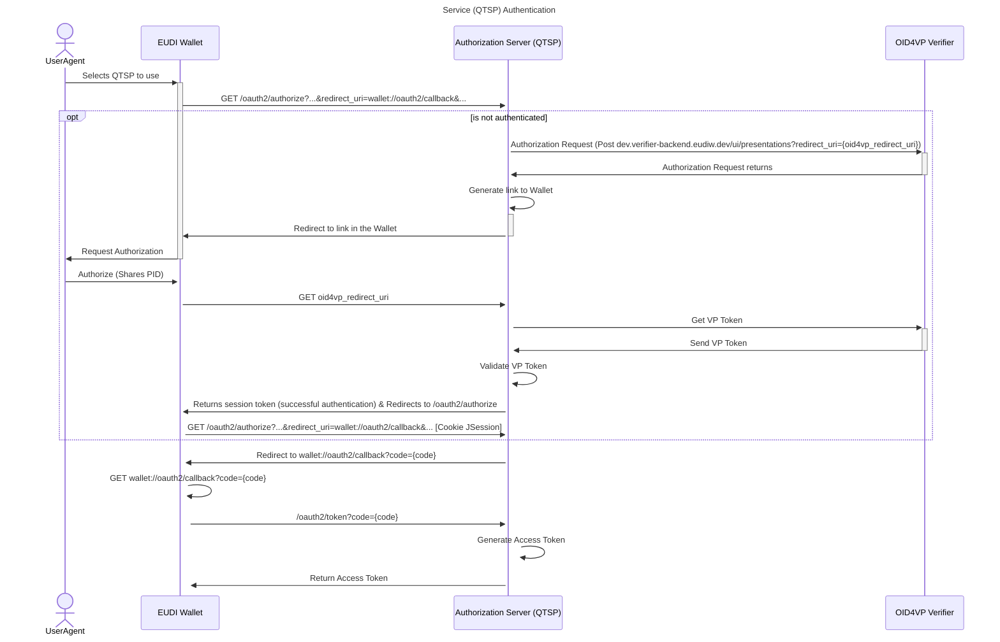
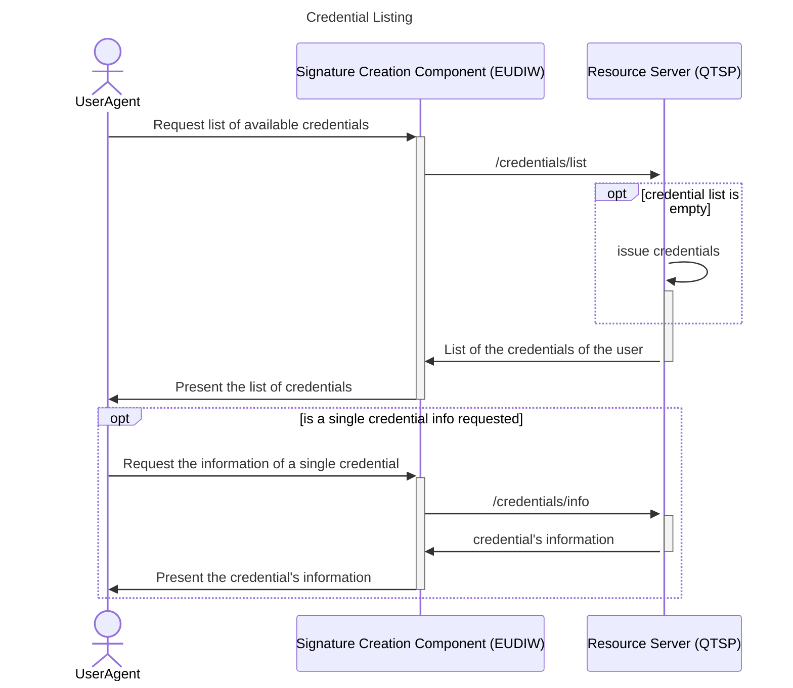
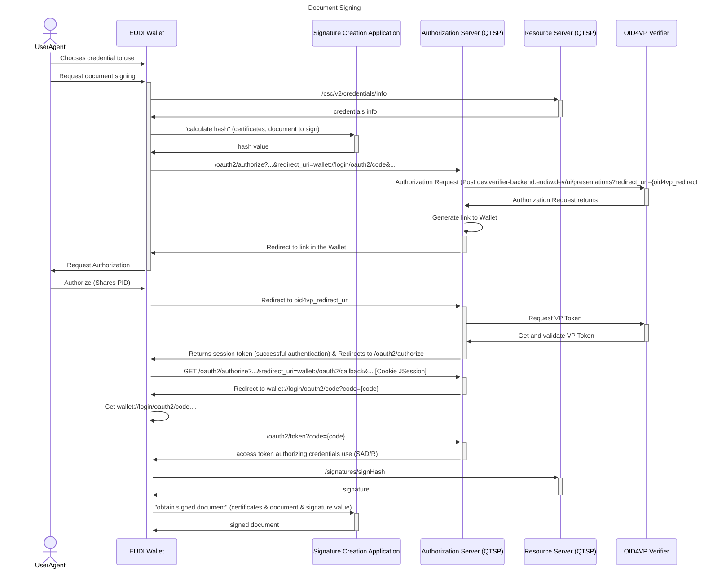
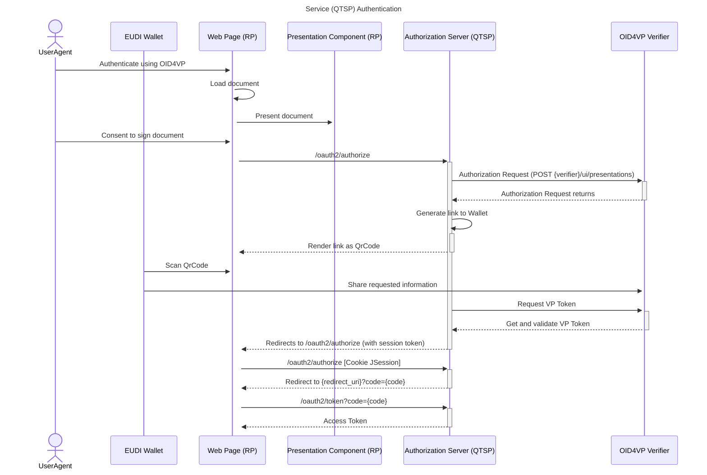
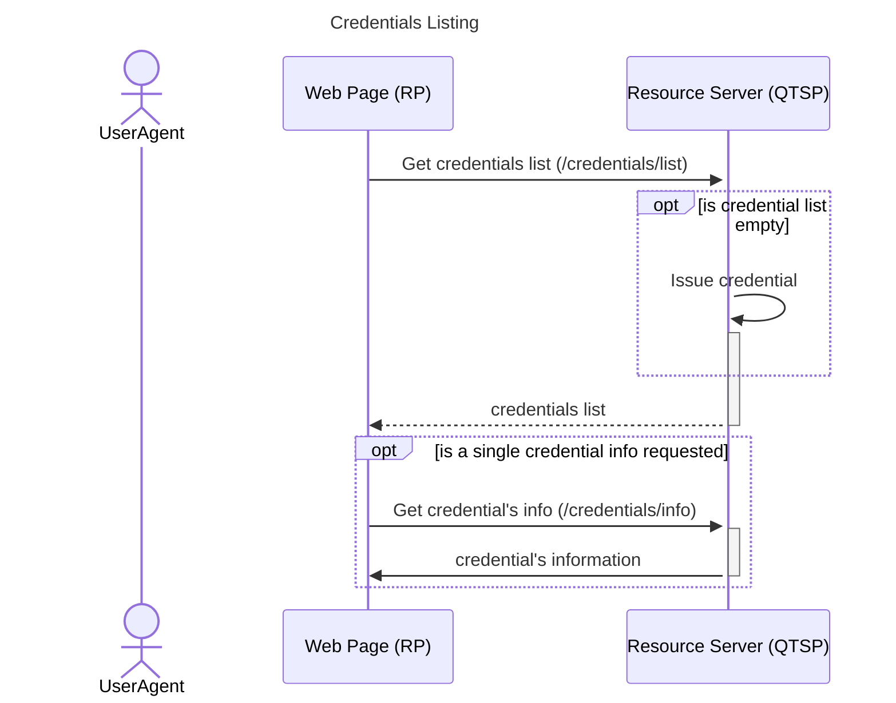
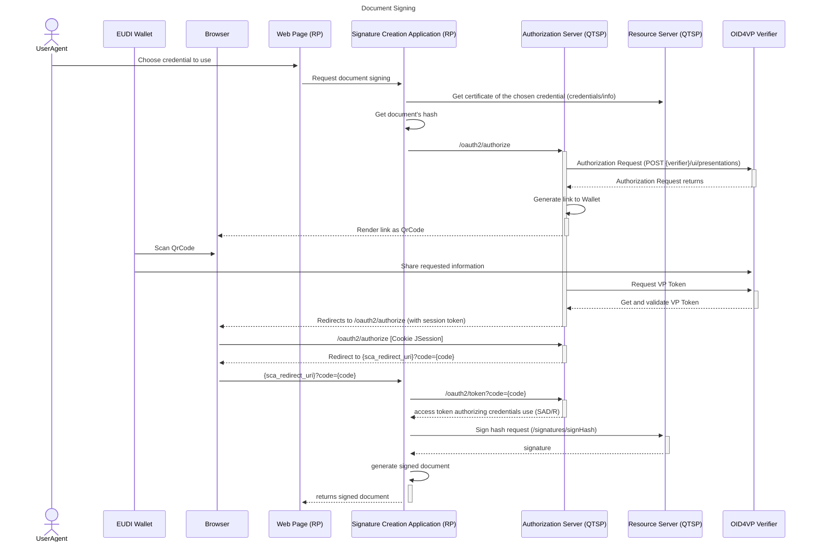

# Remote Signature Service Provider (RSSP)

An RSSP is the entity that provides the remote electronic signature service. It operates the backend infrastructure that:

+ Stores and protects users’ signature keys.
+ Performs remote signature operations when the user requests a signature.

## Reference Implementation Signature Services

The Reference Implementation (RI) Signature services constitute a suite of supporting services within the EUDI Wallet Ecosystem that enable end-to-end testing and validation of remote electronic signature flows. These services provide controlled, standards-based environments for Wallets, Relying Parties, and QTSP-like components to interact in accordance with the EUDI Wallet specifications, and the Wallet-driven and RP-centric signature architectures.

These RI Signature services are made available exclusively as part of the EUDI Wallet Reference Implementation and are intended purely for testing, experimentation, and interoperability validation. They provide a controlled environment to explore and evaluate the different remote signing flows (including Wallet-driven and RP-centric approaches), but they do not constitute production-grade trust services, are not operated as QTSP services, and must not be used to generate real electronic signatures or seals. Their sole purpose is to support developers, integrators, and Member State teams in understanding the expected behaviour of the ecosystem and in verifying that their components interact correctly with the signing interfaces defined in the EUDI Wallet specifications.

### TrustProvider Signer

The TrustProvider Signer is a CSC-compliant Remote Signature Service Provider (RSSP) and Signature Application. It includes:

+ an RSSP backend implementing CSC API behaviours;
+ a Signature Application handling signing orchestration; and
+ a Client interface supporting account creation, OpenID4VP authentication, certificate and key-pair creation, and document signing.

It enables Wallet implementers to test non-qualified remote signing workflows.

#### TrustProvider Signer Service

For testing purposes, a hosted instance of the Reference Implementation TrustProvider Signer service is available at <https://trustprovider.signer.eudiw.dev/login>.

The complete source code, deployment instructions and configuration details for the TrustProvider Signer Reference Implementation are publicly available in the GitHub repository at [eudi-srv-web-trustprovider-signer-java](https://github.com/eu-digital-identity-wallet/eudi-srv-web-trustprovider-signer-java).

### Wallet-Driven Signer

The Wallet-Driven signature flow supports an rQES flow initiated and processed within the EUDI Wallet environment. It encompasses the following functional steps:

1. Service (QTSP) Authentication.

    Before initiating the credential listing or signing operation, the Wallet must authenticate itself to the QTSP. In this signature flow, it is assumed that the Wallet has been previously registered with the QTSP.

    To initiate user authentication with the QTSP (Service Authentication process), the SIC (Signature Activation Component) will send a request to the QTSP Authorization Server. The authentication is carried out using the OAuth2 protocol, complemented by the OpenId4VP protocol.

2. Credential Listing,

    After the user has agreed to sign the document and selected which QTSP will be used, the Wallet shall display the available credentials from the chosen QTSP. To achieve this, the Wallet shall request the list of credentials (including certificates and additional information) from the QTSP.

3. Document Signing.

    The signature process is divided into two main operations: credential authorization and document signing.

    In the credential authorization flow, the Wallet sends the document to be signed, along with the certificate and the certificate chain of the credential chosen, and other relevant information required to the SCA. The SCA (Signature Creation Application) then computes the hash of the document to be signed. Following this, the Wallet requests authorization from the QTSP to use the private signing key, initiating an OAuth2 flow with OpenID for Verifiable Presentations.

    Once the Wallet receives the token granting access to the chosen credential, the document signing process proceeds. The Wallet uses the QTSP API to obtain the signature for the hash value. Finally, a request is sent to the SCA with the signature value, the document to be signed, the certificate, and any other required data.

#### Wallet-Driven Signer Service

The Wallet-Driven Signer service provides a reference implementation of a QTSP (Authorization server and Resource server components), supporting authentication and authorisation via OpenID4VP. It supports the complete rQES Wallet-Driven signature flow, including QTSP authentication, credential listing, and remote signature creation, through endpoints such as /oauth2/authorize, /oauth2/token, and /csc/v2/signatures/signHash.

For testing purposes, a hosted instance of the Reference Implementation Wallet-Driven Signer service is available at:

+ <https://walletcentric.signer.eudiw.dev> - RESTful API server implementing both the SCA and QTSP endpoints, serving as the wallet-centric backend components for the EUDI Wallet (and for any other Wallets wishing to test this flow);
+ <https://walletcentric.signer.eudiw.dev/rp/> - Relying Party web interface that allows users to test the Wallet-Driven signature flow by signing PDF, JSON, XML, and TXT documents using the EUDI Wallet (or any other Wallets wishing to test it).

The complete source code, deployment instructions and configuration details for the Wallet-Driven Signer Reference Implementation are publicly available in the GitHub repositories at:

+ [eudi-srv-web-walletdriven-rpcentric-signer-qtsp-java](https://github.com/eu-digital-identity-wallet/eudi-srv-web-walletdriven-rpcentric-signer-qtsp-java) - RESTful API server that implements a Wallet-Driven and RP-Centric QTSP.
+ [eudi-srv-web-walletdriven-signer-external-sca-java](https://github.com/eu-digital-identity-wallet/eudi-srv-web-walletdriven-signer-external-sca-java) - REST API server implementing the Wallet-driven external SCA component. It integrates with the Wallet-Driven QTSP.
+ [eudi-srv-web-walletdriven-signer-relyingparty-py](https://github.com/eu-digital-identity-wallet/eudi-srv-web-walletdriven-signer-relyingparty-py) - Relying Party (RP) Web Service that enables testing and validation of the Wallet-driven remote signature flow. This service implements an RP that interacts with the Wallet in Wallet-Driven rQES flows. It allows the user to select a sample document, triggers the Wallet signature flow, and receives the resulting signed document.

### Relying Party Centric Signer

The Relying Party-Centric (RP-Centric) signature flow supports an rQES process initiated and orchestrated within the Relying Party environment. It encompasses functional steps that mirror those described for the [Wallet-Driven signer](#wallet-driven-signer):

1. Service (QTSP) Authentication.

2. Credential Listing,

3. Document Signing.

#### RP-Centric Signer Service

The RP-Centric Signer service provides a reference implementation of a QTSP (Authorization server and Resource server components), supporting authentication and authorisation via OpenID4VP. It supports the complete rQES RP-Centric signature flow, including QTSP authentication, credential listing, and remote signature creation, through endpoints such as /oauth2/authorize, /oauth2/token, and /csc/v2/signatures/signHash.

For testing purposes, a hosted instance of the Reference Implementation RP-Centric Signer service is available at:

+ <https://rpcentric.signer.eudiw.dev/tester> - Relying Party web interface that allows users to test the RP-Centric signature flow by signing PDF, JSON, XML, and TXT documents using the EUDI Wallet (or any other Wallets wishing to test it).

The complete source code, deployment instructions and configuration details for the RP-Centric Signer Reference Implementation are publicly available in the GitHub repositories at:

+ [eudi-srv-web-walletdriven-rpcentric-signer-qtsp-java](https://github.com/eu-digital-identity-wallet/eudi-srv-web-walletdriven-rpcentric-signer-qtsp-java) - RESTful API server that implements a Wallet-Driven and RP-Centric QTSP.
+ [eudi-srv-web-rpcentric-signer-sca-java](https://github.com/eu-digital-identity-wallet/eudi-srv-web-rpcentric-signer-sca-java) - REST API server implementing the RP-Centric SCA component. This implementation of the SCA serves as a component of a Relying Party (RP) web service and is used to sign documents.
+ [eudi-srv-web-rpcentric-signer-relyingparty-py](https://github.com/eu-digital-identity-wallet/eudi-srv-web-rpcentric-signer-relyingparty-py) - Relying Party (RP) Web Service that enables testing and validation of the RP-Centric remote signature flow. This service relies on the RP-Centric QTSP Service and on the RP-Centric SCA component, both operating within the RP environment. It implements an RP capable of interacting with the Wallet in RP-Centric rQES flows: it allows the user to select a sample document, initiates the Wallet’s signature process, and receives the resulting signed document.
