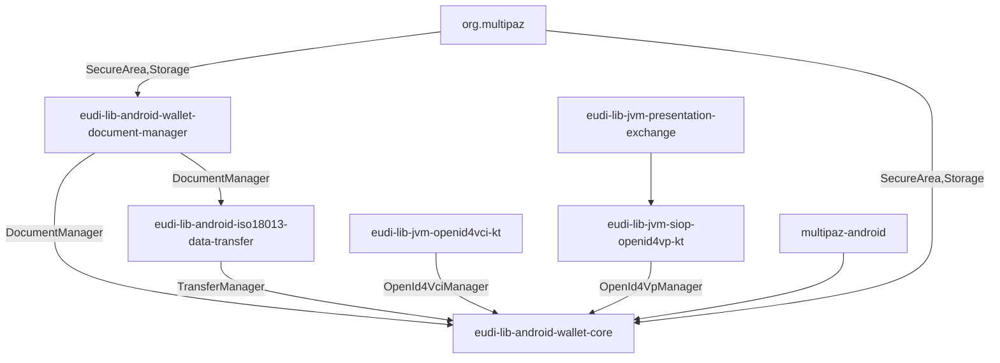

# EUDI Wallet Core library for Android

## Overview

This [repository](https://github.com/eu-digital-identity-wallet/eudi-lib-android-wallet-core){:target="_blank"} contains the EUDI Wallet Core library for Android. The library is part
of the EUDI Wallet Reference Implementation project.

This library acts as a coordinator, orchestrating the various components that are
required to implement the EUDI Wallet functionality. Additionally, it provides a simplified API
that can be used by the application to implement the EUDI Wallet functionality.

The library provides the following functionality:

- Document management
    - ✅ Document Key creation and management with Android Keystore by default
    - ✅ Support for custom SecureArea implementations
    - ✅ Support for multiple SecureArea implementations
- Document issuance
    - Support for OpenId4VCI Draft 14 document issuance
        - ✅ Authorization Code Flow
        - ✅ Pre-authorization Code Flow
        - ✅ Support for mso_mdoc format
      - Support for sd-jwt-vc format
        - ✅ Support for credential offers
        - ✅ Support for DPoP JWT in authorization
      - ✅ Support for JWT proof types
      - ✅ Support for deferred issuance
- Proximity document presentation
    - Support for ISO-18013-5 device retrieval
        - ✅ QR device engagement
        - ✅ NFC device engagement
        - ✅ BLE data transfer
        - ⌛ NFC data transfer
        - ⌛ Wifi-Aware data transfer
- Remote document presentation
    - OpenId4VP document transfer
        - ✅ For pre-registered verifiers
        - ✅ Dynamic registration of verifiers

The library is written in Kotlin and is compatible with Java. It is distributed as a Maven package
and can be included in any Android project that uses Android 8 (API level 26) or higher.
