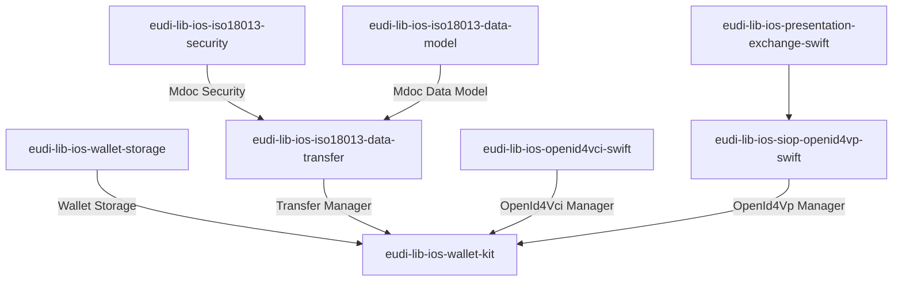

# EUDI Wallet Kit library for iOS

## Overview

The [eudi-lib-ios-wallet-kit repository](https://github.com/eu-digital-identity-wallet/eudi-lib-ios-wallet-kit){:target="_blank"} contains the EUDI Wallet Kit library for iOS. The library is part
of the EUDI Wallet Reference Implementation project.

This library acts as a coordinator, by orchestrating the various components that are
required to implement the EUDI Wallet functionality. On top of that, it provides a simplified API
that can be used by the application to implement the EUDI Wallet functionality.

The library provides the following functionality:

- Document management
    - ✅ Storage encryption
    - ✅ Using iOS Secure Enclave for generating/storing documents' keypair
    - ✅ Enforcing device user authentication when retrieving documents' private keys
- Document issuance
    - Support for OpenId4VCI document issuance
        - ✅ Authorization Code Flow
        - ✅ Pre-authorization Code Flow
        - ✅ Support for mso_mdoc format
        - ✅ Support for sd-jwt-vc format
        - ✅ Support credential offer
        - ✅ Support for DPoP JWT in authorization
        - ✅ Support for JWT and CWT proof types
        - ✅ Support for deferred issuing
- Proximity document presentation
    - Support for ISO-18013-5 device retrieval
        - ✅ QR device engagement
        - ✅ BLE data transfer
- Remote document presentation
    - OpenId4VP document transfer
        - ✅ For pre-registered verifiers
        - ✅ Dynamic registration of verifiers

The library is written in Swift and is compatible with iOS 14 or higher. It is distributed as a Swift package
and can be included in any iOS project.

It is based on the following specifications:

- ISO/IEC 18013-5 – Published
- Presentation Exchange v2.0.0 - Published
- OpenID4VP – Draft 18
- SIOPv2 – Draft
